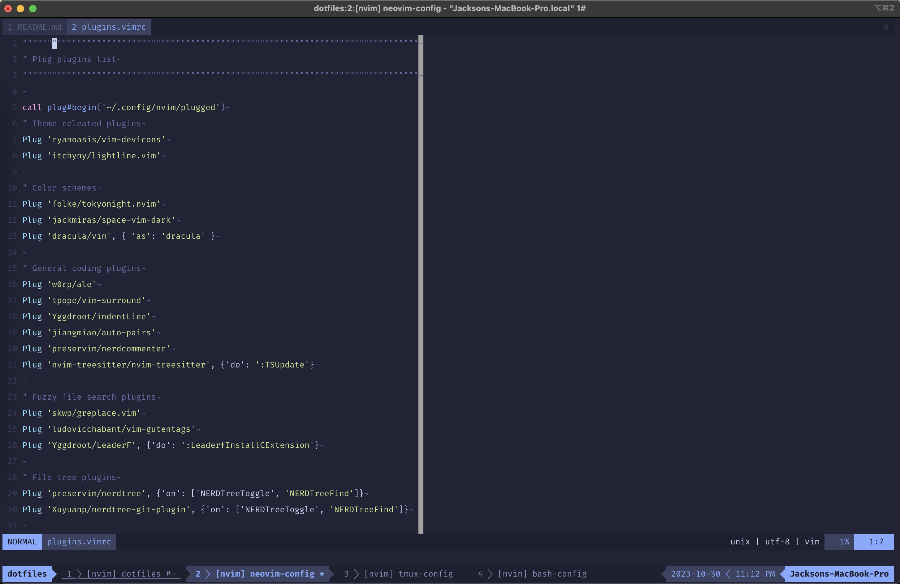

# Neovim - Configs

This are the configurations that I've been using on my daily work. If you 
decide to use this Vim settings you should know some plugins has been 
installed in this Vim config. I also use a different color scheme, so take a 
look in the preview image and in the list down below to check what plugins has 
been installed in this Vim configuration.

## Preview



## Installation
To install this configurations in your Vim you need to download/clone this 
project, them acces the project directory and execute the install-config.sh 
script with the command shown down bellow.

```bash
	# Let's suppose that you have downloaded/cloned the project to your 'Download' folder.
	cd ~/Download/vim-config
	# Then give the execution permission to the isntall-config.sh.
	sudo chmod +x install-config.sh
	# Finally execute.
	./install-config.sh
```

## Color scheme
* Gruvbox. [[link]](https://github.com/morhetz/gruvbox)

## Plugins
* Auto-pairs. [[link]](https://github.com/jiangmiao/auto-pairs)
* Ctrlp. [[link]](https://github.com/ctrlpvim/ctrlp.vim)
* IndentLine [[link]](https://github.com/Yggdroot/indentLine)
* Kotlin-vim. [[link]](https://github.com/udalov/kotlin-vim)
* Nerdtree. [[link]](https://github.com/scrooloose/nerdtree)
* Syntastic. [[link]](https://github.com/vim-syntastic/syntastic)
* Vim-airline. [[link]](https://github.com/vim-airline/vim-airline)
* Vim-Fugitive. [[link]](https://github.com/tpope/vim-fugitive)
* Vim-gitgutter. [[link]](https://github.com/airblade/vim-gitgutter)
* Vim-javascript. [[link]](https://github.com/pangloss/vim-javascript)
* Vim-surround. [[link]](https://github.com/tpope/vim-surround)

